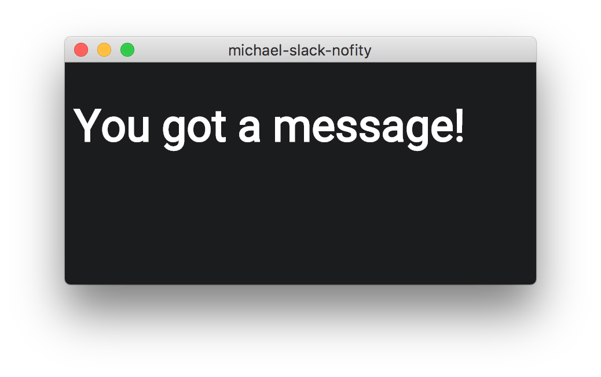

# michael-slack-nofity

There are people like Michael who don't reply on Slack no matter how much you text them.
Those people usually work for megacorps where additional software installation is blocked by Windows Group Policy.
Fortunately there is michael-slack-notify so people like Michael can't argue anymore they didn't see their slack notifications :D.

## Features
- Simple sticky notify window, disappears when all messages read

## Getting started
- `git clone https://github.com/abertschi/michael-slack-notify.git && cd michael-slack-notify`
- `npm install`
